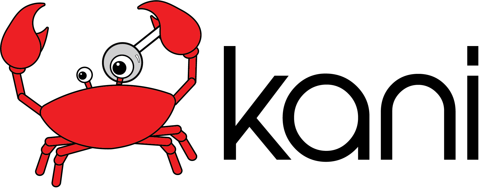

[](https://github.com/model-checking/kani/actions/workflows/kani.yml)
[](https://github.com/model-checking/kani/actions/workflows/cbmc-latest.yml)

The Kani Rust Verifier is a bit-precise model checker for Rust.

Kani is useful for checking both safety and correctness of Rust code.
- *Safety*: Kani automatically checks for many kinds of [undefined behavior](https://model-checking.github.io/kani/undefined-behaviour.html).
This makes it particularly useful for verifying unsafe code blocks in Rust, where the "[unsafe superpowers](https://doc.rust-lang.org/stable/book/ch19-01-unsafe-rust.html#unsafe-superpowers)" are unchecked by the compiler.
- *Correctness*: Kani automatically checks panics (e.g. `unwrap()` on `None`), arithmetic overflows, and custom correctness properties, either in the form of assertions (`assert!(...)`) or [function contracts](https://model-checking.github.io/kani/reference/experimental/contracts.html).

## Installation

To install the latest version of Kani ([Rust 1.58+; Linux or Mac](https://model-checking.github.io/kani/install-guide.html)), run:

```bash
cargo install --locked kani-verifier
cargo kani setup
```

See [the installation guide](https://model-checking.github.io/kani/install-guide.html) for more details.

## How to use Kani

Similar to testing, you write a harness, but with Kani you can check all possible values using `kani::any()`:

```rust
use my_crate::{function_under_test, meets_specification};

#[kani::proof]
fn check_my_property() {
   // Create a nondeterministic input
   let input: u8 = kani::any();

   // Call the function under verification
   let output = function_under_test(input);

   // Check that it meets the specification
   assert!(meets_specification(input, output));
}
```

Kani will try to prove that all valid inputs produce outputs that satisfy the specification, without panicking or exhibiting unexpected behavior.
This example is simple; we highly recommend following [the tutorial](https://model-checking.github.io/kani/kani-tutorial.html) to learn more about how to use Kani.

## GitHub Action

Use Kani in your CI with `model-checking/kani-github-action@VERSION`. See the
[GitHub Action section in the Kani
book](https://model-checking.github.io/kani/install-github-ci.html)
for details.

## Citing Kani

If you use Kani in your research, please cite our ASE 2026 paper.

ACM Reference Format:

> Rémi Delmas, Zyad Hassan, Qinheping Hu, Rahul Kumar, Felipe R. Monteiro, Thanh Nguyen, Adrián Palacios, Celina Val, Michael Tautschnig, Justus Adam, Daniel Schwartz-Narbonne, and Carolyn Zech. 2026. Kani: A Model Checker for Rust. In *Proceedings of the 41st IEEE/ACM International Conference on Automated Software Engineering (ASE '26), October 12–16, 2026, Munich, Germany*. ACM, New York, NY, USA, 13 pages. <https://doi.org/10.1145/3832783.3834499>

BibTeX:

```bibtex
@inproceedings{kani-ase-2026,
  author    = {Delmas, R{\'e}mi and Hassan, Zyad and Hu, Qinheping and Kumar, Rahul and
               Monteiro, Felipe R. and Nguyen, Thanh and Palacios, Adri{\'a}n and
               Val, Celina and Tautschnig, Michael and Adam, Justus and
               Schwartz-Narbonne, Daniel and Zech, Carolyn},
  title     = {{Kani}: A Model Checker for {Rust}},
  year      = {2026},
  publisher = {Association for Computing Machinery},
  address   = {New York, NY, USA},
  url       = {https://doi.org/10.1145/3832783.3834499},
  doi       = {10.1145/3832783.3834499},
  booktitle = {Proceedings of the 41st IEEE/ACM International Conference on Automated Software Engineering},
  numpages  = {13},
  location  = {Munich, Germany},
  series    = {ASE '26}
}
```

The same citation is available in machine-readable form in [CITATION.cff](CITATION.cff),
which powers GitHub's *Cite this repository* button.

## Security
See [SECURITY](https://github.com/model-checking/kani/security/policy) for more information.

## Contributing
If you are interested in contributing to Kani, please take a look at [the developer documentation](https://model-checking.github.io/kani/dev-documentation.html).

## License
### Kani
Kani is distributed under the terms of both the MIT license and the Apache License (Version 2.0).

See [LICENSE-APACHE](LICENSE-APACHE) and [LICENSE-MIT](LICENSE-MIT) for details.

### Rust
Kani contains code from the Rust project.
Rust is primarily distributed under the terms of both the MIT license and the Apache License (Version 2.0), with portions covered by various BSD-like licenses.

See [the Rust repository](https://github.com/rust-lang/rust) for details.
