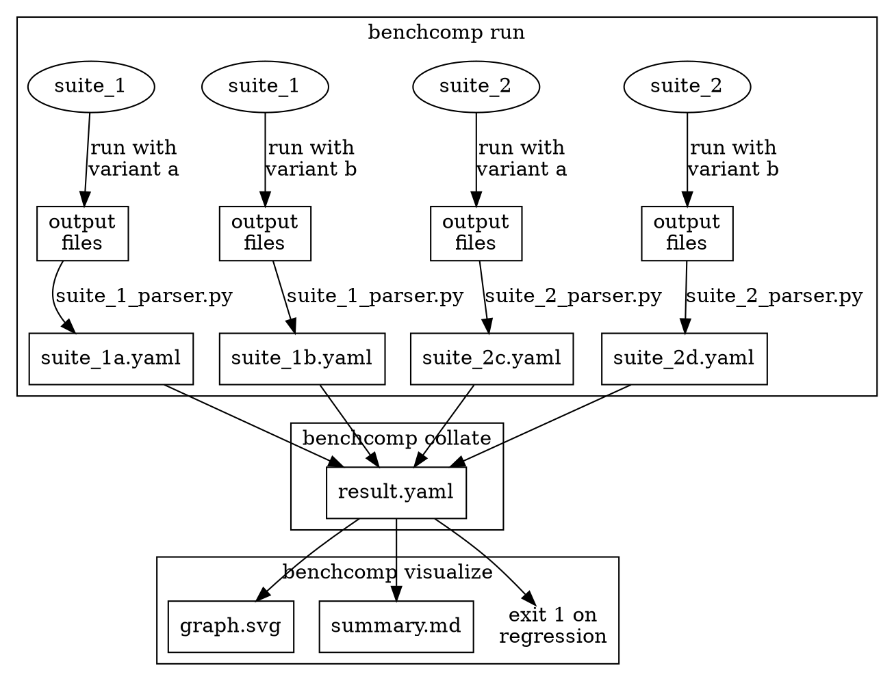

# `benchcomp` command line

`benchcomp` is a single command that runs benchmarks, parses their results, combines these results, and emits visualizations.
`benchcomp` also provides *subcommands* to run these steps individually.
Most users will want to invoke `benchcomp` in one of two ways:

* `benchcomp` without any subcommands, which runs the entire performance comparison process as depicted below
* `benchcomp visualize`, which runs the visualization step on the results of a previous benchmark run without actually re-running the benchmarks.
  This is useful when tweaking the parameters of a visualization, for example changing the threshold of what is considered to be a regression.

The subcommands `run` and `collate` are also available.
The diagram below depicts `benchcomp`'s order of operation.



Running `benchcomp` invokes `run`, `collate`, and `visualize` behind the scenes.
If you have previously run `benchcomp`, then running `benchcomp visualize` will emit the visualizations in the config file using the previous `result.yaml`.

In the diagram above, two different suites (1 and 2) are both run using two *variants*---combinations of command, working directory, and environment variables.
Benchmark suite 2 requires a totally different command line to suite 1---for example, `suite_1` might contain Kani harnesses invoked through `cargo kani`, while `suite_2` might contain CBMC harnesses invoked through `run_cbmc_proofs.py`.
Users would therefore define different variants (`c` and `d`) for invoking `suite_2`, and also specify a different parser to parse the results.
No matter how different the benchmark suites are, the `collate` stage combines their results so that they can later be compared.

## Example config file

Users must specify the actual suites to run, the parsers used to collect their results, and the visualizations to emit in a file called `benchcomp.yaml` or a file passed to the `-c/--config` flag.
The [next section](./benchcomp-conf.md) describes the schema for this configuration file.
A run similar to the diagram above might be achieved using the following configuration file:

```yaml
# Compare a range of Kani and CBMC benchmarks when
# using Cadical versus the default SAT solver

variants:
  variant_a:
    config:
      directory: kani_benchmarks
      command_line: scripts/kani-perf.sh
      env: {}

  variant_b:
    config:
      directory: kani_benchmarks
      command_line: scripts/kani-perf.sh
      # This variant uses a hypothetical environment variable that
      # forces Kani to use the cadical SAT solver
      env:
        KANI_SOLVER: cadical

  variant_c:
    config:
      directory: cbmc_benchmarks
      command_line: run_cbmc_proofs.py
      env: {}

  variant_d:
    config:
      directory: cbmc_benchmarks
      command_line: run_cbmc_proofs.py
      env:
        EXTERNAL_SAT_SOLVER: cadical

run:
  suites:
    suite_1:
      parser:
        module: kani_perf
      variants: [variant_a, variant_b]

    suite_2:
      parser:
        module: cbmc_litani_parser
      variants: [variant_c, variant_d]

visualize:
  - type: dump_graph
    out_file: graph.svg

  - type: dump_markdown_results_table
    out_file: summary.md
    extra_columns: []

  - type: error_on_regression
    variant_pairs:
    - [variant_a, variant_b]
    - [variant_c, variant_d]
```
