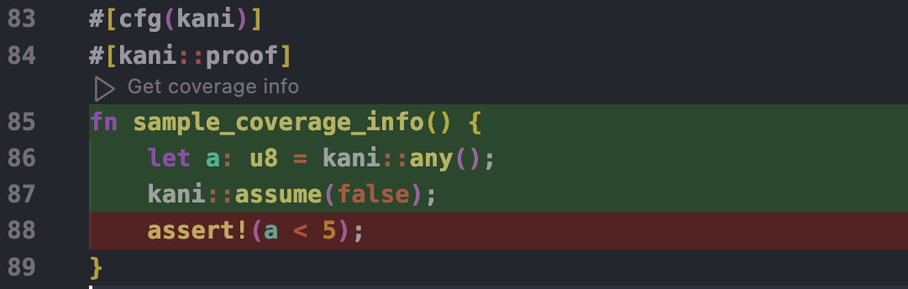

- **Feature Name:** Line coverage (`line-coverage`)
- **Feature Request Issue:** <https://github.com/model-checking/kani/issues/2610>
- **RFC PR:** <https://github.com/model-checking/kani/pull/2609>
- **Status:** Under Review
- **Version:** 0
- **Proof-of-concept:** <https://github.com/model-checking/kani/pull/2609> (Kani) + <https://github.com/model-checking/kani-vscode-extension/pull/122> (Kani VS Code Extension)

-------------------

## Summary

Add verification-based line coverage reports to Kani.

## User Impact

Nowadays, users can't easily obtain verification-based coverage reports in Kani.
Generally speaking, coverage reports show which parts of the code under verification are covered and which are not.
Because of that, coverage is often seen as a great metric to determine the quality of a verification effort.

Moreover, some users prefer using coverage information for harness development and debugging.
That's because coverage information provides users with more familiar way to interpret verification results.

This RFC proposes adding a new option for verification-based line coverage reports to Kani.
As mentioned earlier, we expect users to employ this coverage-related option on several stages of a verification effort:
 * **Learning:** New users are more familiar with coverage reports than property-based results.
 * **Development:** Some users prefer coverage results to property-based results since they are easier to interpret.
 * **CI Integration**: Users may want to enforce a minimum percentage of code coverage for new contributions.
 * **Debugging:** Users may find coverage reports particularly helpful when inputs are over-constrained (missing some corner cases).
 * **Evaluation:** Users can easily evaluate where and when more verification work is needed (some projects aim for 100% coverage).

Moreover, adding this option directly to Kani, instead of relying on another tools, is likely to:
 1. Increase the speed of development
 2. Improve testing for coverage features
Which translates into faster and more reliable coverage options for users.

## User Experience

The goal is for Kani to generate code coverage report per harness in a well established format, such as [LCOV](https://github.com/linux-test-project/lcov), and possibly a summary in the output.
For now, we will focus on an interim solution that will enable us to assess the results of [our instrumentation](#injection-of-coverage-checks) and enable integration with the Kani VS Code extension.

### High-level changes

For the first version, this experimental feature will report verification results along coverage reports.
Because of that, we'll add a new section `Coverage results` that shows coverage results for each individual harness.

In the following, we describe an experimental output format.
Note that the final output format and overall UX is to be determined.

### Experimental output format for coverage results

The `Coverage results` section for each harness will produce coverage information in a CSV format as follows:
```
<file>, <line>, <status>
```
where `<status>` is either `FULL`, `PARTIAL` or `NONE`.

As mentioned, this format is designed for evaluating the [native instrumentation-based design](#detailed-design) and is likely to be substituted with another well-established format as soon as possible.

**Users are not expected to consume this output directly.**
Instead, coverage data is to be consumed by the [Kani VS Code extension](https://github.com/model-checking/kani-vscode-extension) and displayed as in the following picture:



How to activate and display coverage information in the extension is out of scope for this RFC.
That said, a proof-of-concept implementation is available [here](https://github.com/model-checking/kani-vscode-extension/pull/122).

## Detailed Design

### Arquitecture

We will add a new unstable `--coverage` verification option to Kani which will require `-Z line-coverage` until this feature is stabilized.
We will also add a new `--coverage-checks` option to `kani-compiler`, which will result in the injection of coverage checks before each Rust statement and terminator[^coverage-experiments].
This option will be supplied by `kani-driver` when the `--coverage` option is selected.
These options will cause Kani to inject coverage checks during compilation and postprocess them to produce the coverage results sections described earlier.

### Coverage Checks

Coverage checks are a new class of checks similar to [`cover` checks](https://model-checking.github.io/kani/rfc/rfcs/0003-cover-statement.html).
The main difference is that users cannot directly interact with coverage checks (i.e., they cannot add or remove them manually).
Coverage checks are encoded as an `assert(false)` statement (to test reachability) with a fixed description.
In addition, coverage checks are:
 * Hidden from verification results.
 * Postprocessed to produce coverage results.

In the following, we describe the injection and postprocessing procedures to generate coverage results.

#### Injection of Coverage Checks

The injection of coverage checks will be done while generating code for basic blocks.
This allows us to add one coverage check before each statement and terminator, which provides the most accurate results[^coverage-experiments].
It's not completely clear how this compares to the coverage instrumentation done in the Rust compiler, but an exploration to use the compiler APIs revealed that they're quite similar[^coverage-api].

#### Postprocessing Coverage Checks

The injection of coverage checks often results in one or more checks per line (assuming a well-formatted program).
We'll postprocess these checks so for each line
 - if all checks are `SATISFIED`: return `FULL`
 - if all checks are `UNSATISFIED`: return `NONE`
 - otherwise: return `PARTIAL`

We won't report coverage status for lines which don't include a coverage check.

## Rationale and alternatives

### Benefits from a native coverage solution

Kani has relied on [`cbmc-viewer`](https://github.com/model-checking/cbmc-viewer) to report coverage information since the beginning.
In essence, `cbmc-viewer` consumes data from coverage-focused invocations of CBMC and produces an HTML report containing (1) coverage information and (2) counterexample traces.
Recently, there have been some issues with the coverage information reported by `cbmc-viewer` (e.g., [#2048](https://github.com/model-checking/kani/issues/2048) or [#1707](https://github.com/model-checking/kani/issues/1707)), forcing us to mark the `--visualize` option as unstable and disable coverage results in the reports (in [#2206](https://github.com/model-checking/kani/pull/2206)).

However, it's possible for Kani to report coverage information without `cbmc-viewer`, as explained before.
This would give Kani control on both ends:
 * **The instrumentation performed** on the program. Eventually, this would allow us to report more precise coverage information (maybe similar to [Rust's instrument-based code coverage](https://doc.rust-lang.org/rustc/instrument-coverage.html)).
 * **The format of the coverage report** to be generated. Similarly, this would allow us to generate coverage data in different formats (see [#1706](https://github.com/model-checking/kani/issues/1706) for GCOV, or [#1777](https://github.com/model-checking/kani/issues/1777) for LCOV). While technically this is also doable from `cbmc-viewer`'s output, development is likely to be faster this way.

#### Coverage through `cbmc-viewer`

As an alternative, we could fix and use `cbmc-viewer` to report line coverage.

Most of the issues with `cbmc-viewer` are generally due to:
 1. Missing locations due to non-propagation of locations in either Kani or CBMC.
 2. Differences in the definition of a basic block in CBMC and Rust's MIR.
 3. Scarce documentation for coverage-related options (i.e., `--cover <option>`) in CBMC.
 4. Limited testing with Rust code in `cbmc-viewer`.

Note that (1) is not exclusive to coverage results from `cbmc-viewer`.
Finding checks with missing locations and propagating them if possible (as suggested in [this comment](https://github.com/model-checking/kani/issues/2048#issuecomment-1599680694)) should be done regardless of the approach used for line coverage reports.

In contrast, (2) and (3) can be considered the main problems for Kani contributors to develop coverage options on top of `cbmc-viewer` and CBMC.
It's not clear how much effort this would involve, but (3) is likely to require substantial documentation contributions.
But (4) shouldn't be an issue if we decided to invest in `cbmc-viewer`.

Finally, the following downside must be considered:
`cbmc-viewer` can report line coverage but **the path to report region-based coverage may involve a complete rewrite**.

#### Other output formats

One of the long-term goals for this feature is to provide a UX that is familiar for users.
This is particularly relevant when talking about output formats.
Some services and frameworks working with certain coverage output formats have become quite popular.

However, this version doesn't consider common output formats (i.e., GCOV or LCOV) since coverage results will only be consumed by the Kani VS Code Extension at first.
But other output formats will be considered in the future.

## Open questions

Open questions:
 * Do we want to report line coverage as `COVERED`/`UNCOVERED` or `FULL`/`PARTIAL`/`NONE`?
 * Should we report coverage results and verification results or not? Doing both is likely to result in worse performance. We have to perform an experimental evaluation with hard benchmarks.
 * What should be the final UX for this feature? For instance, we could print a coverage summary and generate a report file per harness. But it's not clear if individual results are relevant to users, so another possibility is to automatically combine results.
 * What's the most appropriate and well-established output format we can emit?

Feedback to gather before stabilization:
 * Compare the injection-based approach in this RFC with [Rust's instrument-based code coverage](https://doc.rust-lang.org/rustc/instrument-coverage.html)?
 * Determine if there are cases for which coverage information is confusing for users (due to, e.g., constant propagation or other compiler optimizations).

## Future possibilities

We expect many incremental improvements in the coverage area:
 1. Consuming the output produced in coverage results from the [Kani VS Code extension](https://github.com/model-checking/kani-vscode-extension).
 2. Building a tool that produces coverage results by combining the coverage results of more than one harness.
 3. Including span information in coverage checks and building region-based coverage reports.
 4. Adding new user-requested coverage formats such as GCOV [#1706](https://github.com/model-checking/kani/issues/1706) or LCOV [#1777](https://github.com/model-checking/kani/issues/1777).

[^coverage-experiments]: We have experimented with different options for injecting coverage checks.
For example, we have tried injecting one before each basic block, or one before each statement, etc.
The proposed option (one before each statement AND each terminator) gives us the most accurate results.

[^coverage-api]: In particular, comments in [`CoverageSpan`](https://doc.rust-lang.org/nightly/nightly-rustc/rustc_mir_transform/coverage/spans/struct.CoverageSpan.html) and [`generate_coverage_spans`](https://doc.rust-lang.org/nightly/nightly-rustc/rustc_mir_transform/coverage/spans/struct.CoverageSpans.html#method.generate_coverage_spans) hint that the initial set of spans come from `Statement`s and `Terminators`. [This comment](https://github.com/model-checking/kani/pull/2612#issuecomment-1646312827) goes in detail about the attempt to use the compiler APIs.
